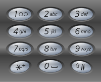

# 17 Letter Combinations of a Phone Number – Medium


### Problem:


Given a digit string, return all possible letter combinations that the number could represent.

A mapping of digit to letters (just like on the telephone buttons) is given below.



Input:Digit string "23"
Output: ["ad", "ae", "af", "bd", "be", "bf", "cd", "ce", "cf"].
Note:
Although the above answer is in lexicographical order, your answer could be in any order you want.


### Thoughts:


Use modified DFS to solve the problem, keep a current built string and add it to the result until all numbers have been evaluated.


### Solutions:

```java
public class Solution {
    public List<String> letterCombinations(String digits) {
        HashMap<Character, String> keyboard = new HashMap<Character, String>();
        initKeyboard(keyboard);
        List<String> result = new LinkedList<String>();
        if (digits.length() == 0) {
            return result;
        }
        compile(digits, "", 0, keyboard, result); 
        return result;
    }
    private void compile(String digits, String prefix, int start, HashMap<Character, String> keyboard, List<String> result) {
        if (start == digits.length()) {
            result.add(prefix);
            return;
        }
        String cand = keyboard.get(digits.charAt(start));
        for (int j = 0; j < cand.length(); j++) {
            compile(digits, prefix + cand.charAt(j), start + 1, keyboard, result);
        }
    }
    private void initKeyboard(HashMap<Character, String> keyboard) {
        keyboard.put('2', "abc");
        keyboard.put('3', "def");
        keyboard.put('4', "ghi");
        keyboard.put('5', "jkl");
        keyboard.put('6', "mno");
        keyboard.put('7', "pqrs");
        keyboard.put('8', "tuv");
        keyboard.put('9', "wxyz");
    }
}
```