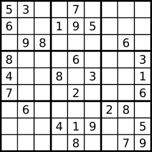

# 36 Valid Sudoku – Easy


### Problem:


Determine if a Sudoku is valid, according to: Sudoku Puzzles – The Rules.

The Sudoku board could be partially filled, where empty cells are filled with the character '.'.



A partially filled sudoku which is valid.

Note:
A valid Sudoku board (partially filled) is not necessarily solvable. Only the filled cells need to be validated.


### Thoughts:


Just follow the basic rules for a valid Sudoku : No duplicate vertically, horizontal, squarely.


### Solutions:


```java
public class Solution {
    public boolean isValidSudoku(char[][] board) {
        Set<Character> helper = new HashSet<Character>();
        for (int i = 0;i < board.length; i ++) {
            helper.clear();
            for (int j = 0; j < board.length; j ++) {
                if (process(helper, board[i][j]) == false)
                    return false;
            }
        }
        for (int j = 0;j < board.length; j ++) {
            helper.clear();
            for (int i = 0; i < board.length; i ++) {
                if (process(helper, board[i][j]) == false)
                    return false;
            }
        }
        for(int i = 0; i<9; i+= 3){
            for(int j = 0; j<9; j+= 3){
                helper.clear();
                for(int k = 0; k<9; k++){
                    if(!process(helper, board[i + k/3][ j + k%3]))
                        return false;                   
                }
            }
        }
 
        return true;
    }
    private boolean process(Set<Character> helper, char c) {
        if (c == '.') {
            return true;
        }
        if (helper.contains(c)) {
            return false;
        }
        helper.add(c);
        return true;
    }
}
```